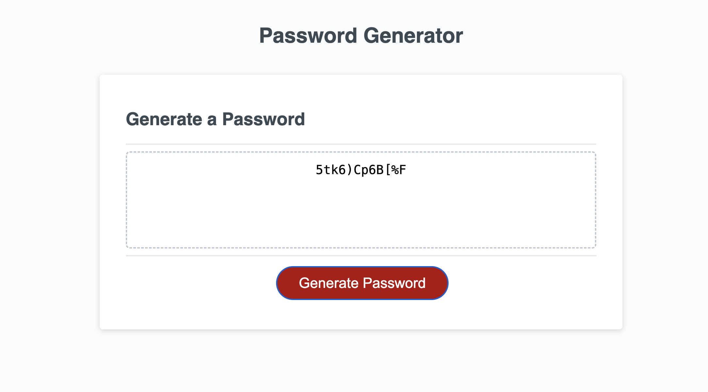

# Password-Generator
Password Generator used to generate a password based on criteria selected

## Description

The aim of this project was to create an application to generate a password based on the length and character types to be included in the password as selected by the user in sresponse to several prompts. This was achieved by modifying starter code in javascript. 

Version control was through git and the updated repository can be found at:

https://github.com/ShaliniSunkuru/Password-Generator 

## Table of Contents

- User Story
- Acceptance Critera
- Screenshot
- Technology Used
- Deployment
- Usage

## User Story

AS an employee\
I WANT to use the application to generate a password\ 
SO THAT my password is strong and conforms to criteria I select based on prompts\

## Acceptance Criteria

GIVEN a password generator app\
WHEN I click on the Generate Password button,\
I should get a prompt for selecting the length of password\
WHEN I enter the length less than 8 or greater than 129\
I should get a prompt asking me to enter length within the range\
WhEN I enter a suitable length within the range\
I get prompts asking me to select the type of characters to be included from special characters, numerical characters, lower case characters and upper case character\
IF I do not select any character type\
I get an alert that I should select at least one character type\ 
WHEN I select the types of characters\
I can see a password generated based on the chosen length and character types\

## Screenshot

Here is a screenshot of the data displayed on the console.

## Technology Used

The following tools and technologies were used in this project

- HTML5
- Javascript
- Visual Studio Code
- GIT
- Github
  
## Deployment

Here is a link to the deployed project.

https://shalinisunkuru.github.io/Password-Generator/ 

## Usage

Click on the url for the deployed project.\
Click on the Generate Password button.\
You should get a prompt asking for length of password between 8 and 128 characters.\
Enter the length.\
You should get prompts for character types to be included. Click OK to include a character type or cancel to not include it.\
A pssword based on the criteria you selected should appear in the box.

## Credits

I appreciate the guidance of the instrutor and TAs of edX Bootcamp. W3Schools, MDN docs, and stack overflow have been a great help in grasping the concepts of arrays, functions, and objects in javascript that were extensively used in creating this application.

## License

Please refer to the MIT License in the repository.

